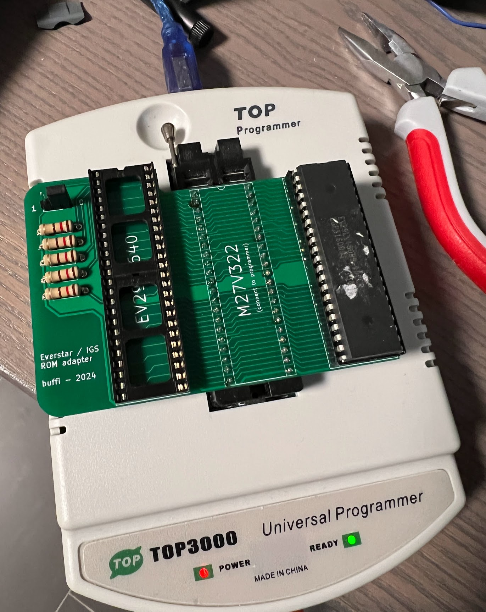
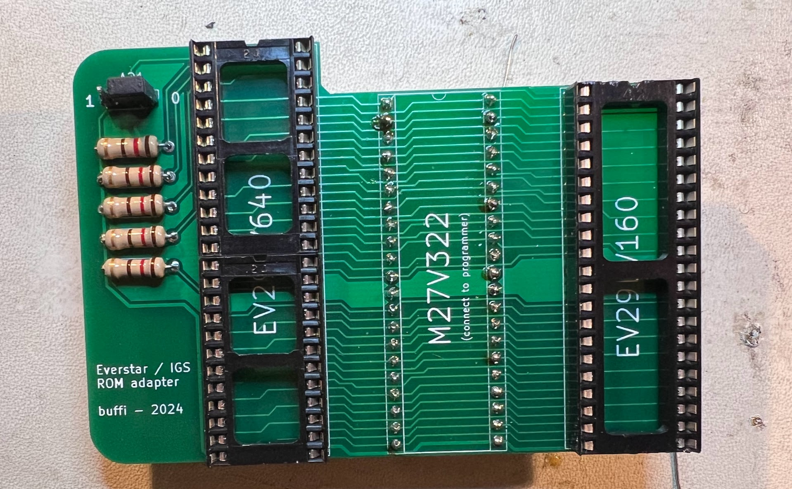
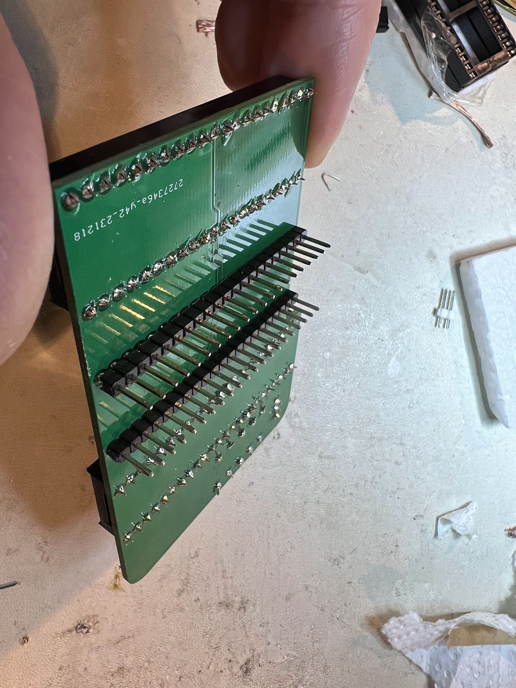
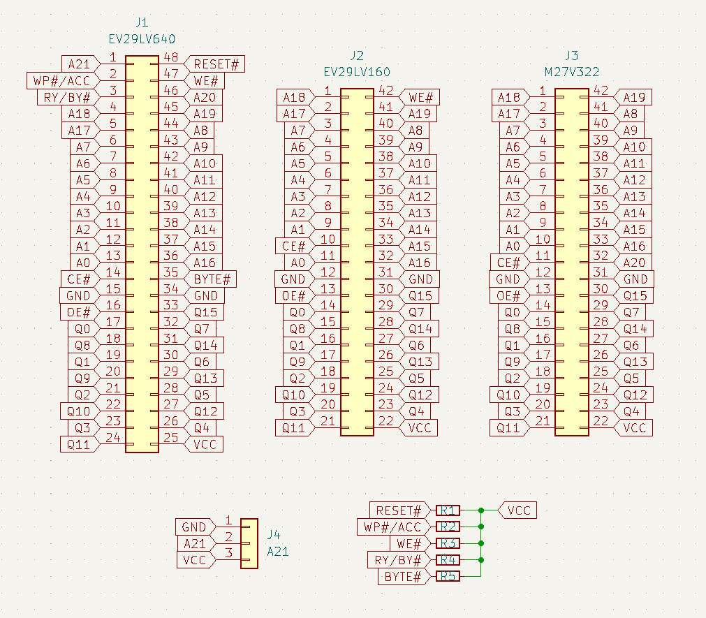
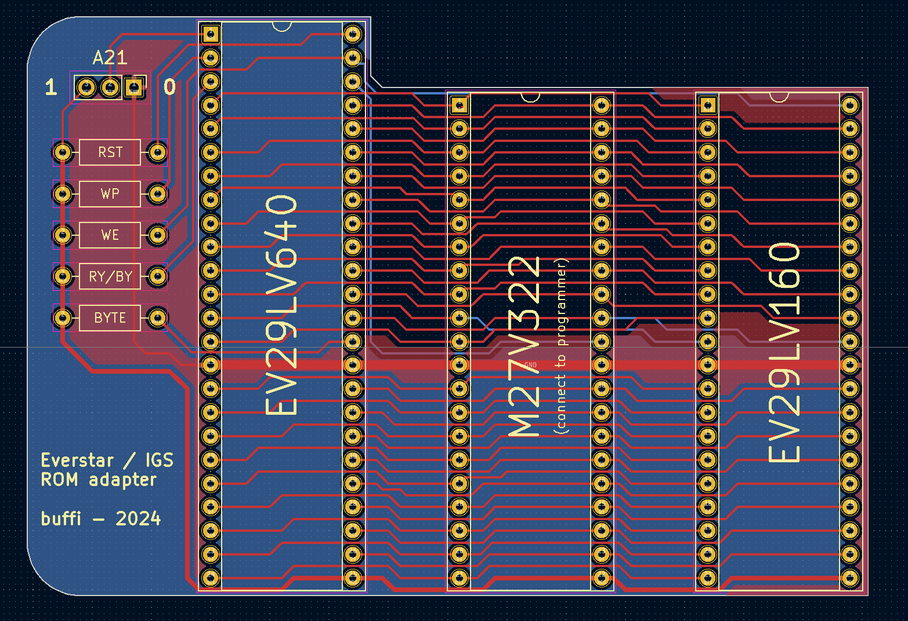
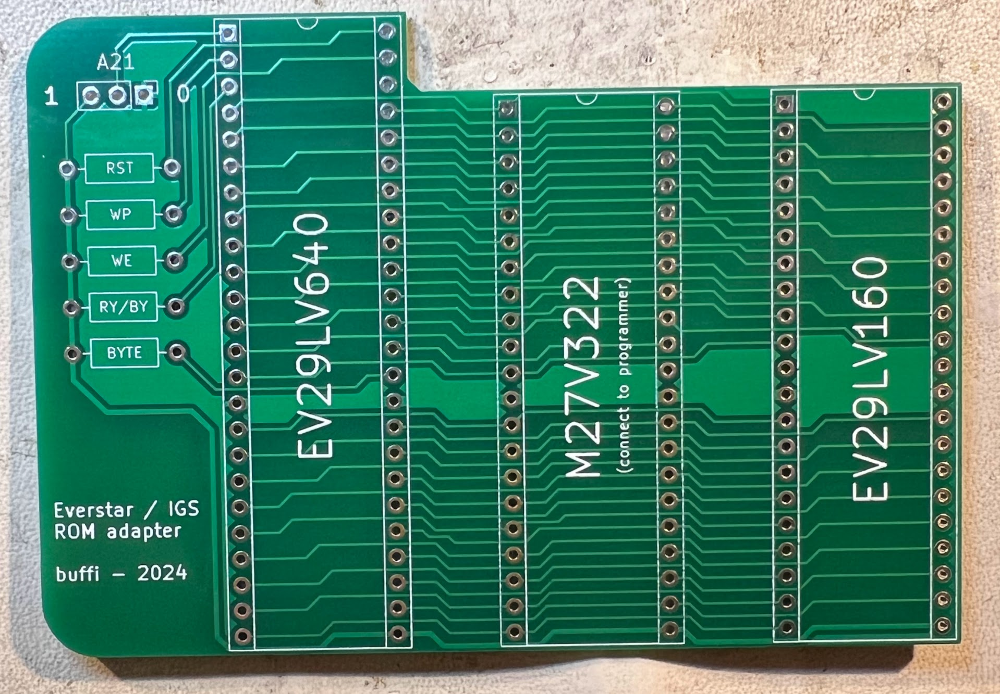

# IGS/Everstar ROM Adapter

Simple adapter for dumping IGS/Everstar EV29LV160 and EV29LV640 ROMs with any programmer supporting M27V322 EPROMs.

These ROMs appear on IGS-made boards, and are not supported by most programmers.

Note that these ROMs are 3.3V. Make sure your programmer uses 3.3V supply voltage for M27V322. 

Gerbers ready for fabrication is available in adapter/gerber/gerber.zip

## BOM

- 1x 42pin DIP socket
- 2x 24pin DIP sockets
- 2x 01x21 2.54mm pin header
- 1x 01x03 2.54mm pin header
- 1x 2.54mm jumper
- 5x through-hole resistors (value not very important, I used 100ohm)

## Build instructions

1. Mount 42pin DIP socket on the EV29LV160 position.
2. Mount 2x 24pin DIP sockets on the EV29LV640 position.
3. Mount 2x 21pin headers on the underside of the board at the M27V322 position.
4. Mount 3pin header at the A21 position. Attach a jumper between center pin and 0.
5. Mount 5x pull-up resistors.

Should end up looking like this:

## Dumping EV29LV160

1. Insert EV29LV160 into the socket marked for it.
2. Dump as M27V322
3. Ignore any error about pin 32 not being connected.
4. This will dump to a file of size 0x400000, containing the same data twice.
5. Discard the duplicate data from 0x200000 to the end of file.
6. The remaining data (size 0x200000) contains the dump.

## Dumping EV29LV640

1. Insert EV29LV640 into the socket marked for it.
2. Make sure the A21 jumper ties the center pin with the pin marked 0.
3. Dump as M27V322, save to a file 0.bin.
4. Move jumped to tie center pin with pin marked 1.
5. Dump as M27V322, save to a file 1.bin.
6. Concatenate the two files. 0.bin first, then 1.bin directly after that data.
7. The merged data (size 0x800000) contains the dump.

## Schematic and Board layout

